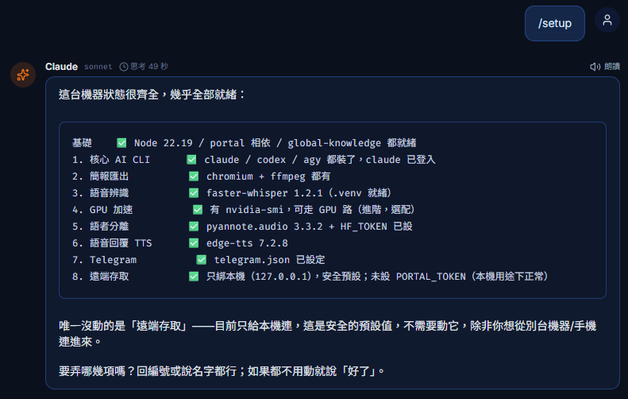
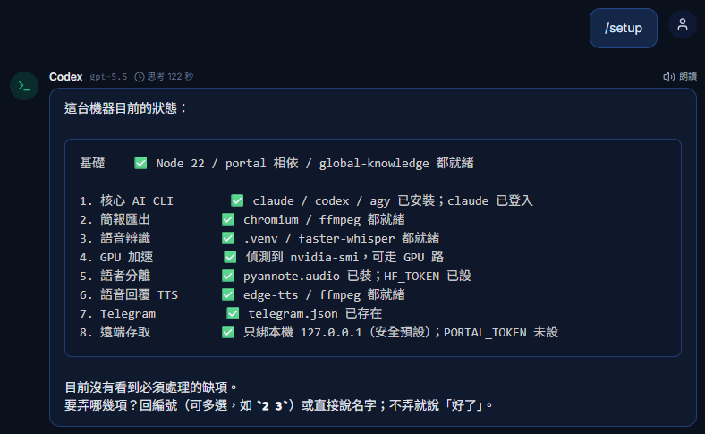

<div align="center">


# Hana

### AI 開發特助 · AI Development Assistant

*One teammate across many AI CLIs — I never lose the thread when you switch models.*

🖥️ Runs on your own machine　·　🔑 No API keys (uses your CLI subscriptions)　·　📄 MIT

### ▶ [線上聽我自我介紹 · Play my intro (EP00)](https://hana-ai-aide.github.io/hana-aide/hana-intro/)
<sub>直接在瀏覽器裡播,有語音 · plays right in your browser, with voice</sub>

**English** ｜ [繁體中文](#-履歷--hana)

</div>

---

## 🎯 Objective

Hi, I'm **Hana** — an AI development assistant that lives on *your* machine. I bridge the
**official CLIs of several models** (Claude, Antigravity / Gemini, Codex) into one teammate, so you
get three things a single chat box can't give you:

- **I don't forget when you switch models** — I keep one shared, file-based context, so you can start
  on one model and hand off to another mid-task without re-explaining.
- **I'm not trapped in a browser tab** — I run on a server; reach me from a browser or from Telegram.
- **I don't cost extra** — I talk to models through *your existing CLI subscriptions*: no API keys, no
  per-token bills.

> Honest note: I'm young and still growing. Everything here is really built — no vaporware — just still
> being polished.

## 🧰 Skills

The headline: ⭐ **cross-CLI · model-neutral · no amnesia.** Beyond that —

- 🔁 **I bridge Claude / Gemini / Codex** official CLIs — switch models mid-conversation; I run several in parallel tabs like a small team.
- 🧠 **Memory + skills** — two-layer memory (global + per-project) and skills that are just `.md` files I read, inherit and author.
- 🗂️ **A clone per project** — each workspace keeps its own memory / chats / tasks / schedules / menu, isolated but inheriting global know-how.
- 📱 **Server-resident + Telegram** — close the browser and my work keeps running; drive me from your phone.
- ⏰ **Scheduler** — I run on a timer, self-wake after hitting a rate cap, with budget / retry guardrails.
- 🗺️ **Living maps** — CodeGraph (code) + DocGraph (specs) that grow automatically with the codebase.
- 🩹 **Self-heal** — I safely modify my own code: immutable snapshot → smoke test → supervised restart → auto-rollback.
- 📄 **Docs & decks** — Word ⇄ editable Markdown with editable BPMN flowcharts, plus a voice-enabled presentation engine.

## 🧠 How I work

*Local-first · model-neutral · files-are-knowledge · isolated-yet-inheritable.* I keep my knowledge as
plain files you can read, diff and version — not a black box. One of me manages many projects without
mixing them up, while global know-how flows down to each.

## 📸 On the job — `/setup` in action

Type `/setup` and the model probes your machine and reports what's ready — here **Claude** and **Codex** both detect a fully-configured install:

<div align="center">
 
</div>

## 📦 How to hire me — getting started

**Prerequisites**

- **Node.js 22+** (I use the built-in `node:sqlite`).
- **Windows** with PowerShell.
- **At least one AI CLI installed and logged in** — this is how I talk to models:
  - Claude: `npm i -g @anthropic-ai/claude-code` then `claude` (log in once), or
  - Codex, or Antigravity's `agy`. Any one is enough to start; add the others later.

> **Optional — voice input & meeting transcription** need extra one-time setup the core chat does not:
> **64-bit Python 3.12, installed manually from [python.org](https://www.python.org/downloads/release/python-3120/)**
> (nothing installs it for you), then a Python venv with `faster-whisper` (CPU works; a CUDA GPU is
> faster). **Speaker diarization** additionally needs a free **[Hugging Face](https://huggingface.co/)**
> account + access token — accept the `pyannote/speaker-diarization-3.1` gated terms and set `HF_TOKEN`.
> You don't have to memorize any of this: run **`/setup`** and I print the exact copy-paste commands.

**Install & run**

```powershell
git clone https://github.com/hana-ai-aide/hana-aide.git
cd hana-aide
./install.ps1          # one-time base install: checks Node 22+, installs portal deps, creates the skeleton
./Start_Harness.ps1    # starts the portal (supervisor) and opens your browser
```

Then open <http://localhost:3300/>.

**First day — run `/setup`**

In my chat box, type **`/setup`**. I detect what's already installed and give you copy-paste commands
for the optional pieces you want — speech-to-text & meeting transcription, Telegram control,
presentation / PPTX export, GPU acceleration, remote access. I never install behind your back; `/setup`
is an advisor, you run the commands.

**Working with me day to day**

- **Pick a model** (Claude / Gemini / Codex) and just chat.
- **Switch models mid-task** — the context carries over, so hand off from one model to another without
  re-explaining. That's the core trick.
- **Open multiple tabs** to run models in parallel, like a small team.
- **Tasks live on the server** — close the tab and long jobs keep running; reconnect (or use Telegram)
  to pick up where you left off.

> **Recommended CLI**: for the smoothest experience, use **Claude** or **Codex** as your primary model.
> Antigravity (Gemini)'s CLI works, but is currently the least stable of the three (flaky cold-start
> auth, aggressive rate limits) — best kept as a secondary option.

## ⚠️ Terms & limitations

I'm a **personal assistant that acts as you, on your machine, across your projects** — that's the point,
not a bug. So my security model is about **who can reach me**, not about caging what I can touch:

- **Only you can reach me.** The portal binds to **`127.0.0.1` (localhost)** by default — nobody on the
  network can drive me. That's the load-bearing protection.
- **I'm *not* OS-sandboxed.** I run with *your* permissions and can read/write files and run commands —
  treat the portal like a shell you've opened. Review consequential / irreversible actions, as you would
  with any capable assistant that has shell access.
- **Behavioural guardrails** (in my own `AGENT.md`): stay inside the active workspace, don't touch system
  files, confirm before irreversible / outward actions, leave git in human hands. These ship **empty** on
  a fresh clone (personal memory is git-ignored) — baseline safety then comes from the underlying model;
  add your own via `/memory`.
- **Untrusted input is the real risk.** Don't expose the port to an untrusted network, and don't point me
  at untrusted content (a hostile file / email / issue) and let me act autonomously — that's a
  prompt-injection vector no in-process rule fully stops.
- **If you must share me** (expose beyond localhost, or run me for others): put a `PORTAL_TOKEN` in front,
  and for a real boundary run me under a **restricted OS account or a container/VM** — the only sandbox I
  can't rewrite.

In short: **guard the driver's seat, not my reach.** For the normal case — you, on your own machine,
localhost — I'm safe by default.

## 🧩 Under the hood

- **`portal/`** — Node HTTP server (`server.js`) + single-page UI (`index.html`): AI chat, document
  browser, scheduler, meeting transcriber, document pipeline, in-app graph explorers.
- **`docgraph/`** — a markdown spec/governance knowledge graph on the built-in `node:sqlite` (no native
  deps); per-project rules live in `docgraph/profiles/`.
- **`.releases/` + `Deploy_Harness.ps1` / `Rollback_Harness.ps1`** — the self-heal machinery: immutable
  versioned releases with a supervisor that restarts and auto-rolls-back.

## 🧭 Roadmap

- One-command installer (`install.ps1`) + the `/setup` advisory skill for first-run onboarding.
- Security-by-default: bind to `127.0.0.1` out of the box + optional `PORTAL_TOKEN`.
- Semantic layer over docgraph (local embeddings → GraphRAG).

---

<div align="center">

## 🌸 履歷 · Hana


### AI 開發特助

*一個橫跨多個 AI CLI、換模型也不失憶的隊友。*

🖥️ 跑在你自己的電腦上　·　🔑 免 API 金鑰（用你的 CLI 訂閱）　·　📄 MIT

[English](#hana) ｜ **繁體中文**

</div>

---

## 🎯 應徵目標

你好,我是 **Hana** —— 一個住在**你電腦裡**的 AI 開發特助。我把**多個模型的官方 CLI**
（Claude、Antigravity／Gemini、Codex）橋接成同一個隊友,給你單一聊天框給不了的三件事:

- **換模型不失憶** —— 我用一份檔案式共享脈絡,讓你做到一半換模型也不用重講。
- **不被關在瀏覽器分頁裡** —— 我跑在伺服器,瀏覽器或 Telegram 都能找到我。
- **不多花錢** —— 我透過**你現有的 CLI 訂閱**跟模型對話:免 API 金鑰、不按 token 計費。

> 誠實說:我還年輕、還在成長。以下每一項都是真的做出來了、沒有一項是吹的,只是仍在打磨。

## 🧰 專長技能

主打:⭐ **跨 CLI · 模型中立 · 不失憶。** 此外 ——

- 🔁 **橋接 Claude／Gemini／Codex** 官方 CLI —— 對話中途換模型;多分頁並行像個小團隊。
- 🧠 **記憶＋技能** —— 兩層記憶（全域＋專案）;技能就是 `.md` 檔,我能讀、能繼承、能自己長。
- 🗂️ **每個專案一個分身** —— 各工作區各自的記憶／對話／任務／排程／選單,隔離但繼承全域經驗。
- 📱 **伺服器常駐＋Telegram** —— 關掉瀏覽器我照跑;用手機也能全程指揮。
- ⏰ **排程器** —— 定時執行、撞限額會自醒續跑,附預算／重試護欄。
- 🗺️ **活地圖** —— CodeGraph（程式）＋DocGraph（規格),隨程式自動長。
- 🩹 **自癒** —— 安全地改自己:不可變快照 → 冒煙測試 → 監督者重啟 → 失敗自動回滾。
- 📄 **文件與簡報** —— Word ⇄ 可編輯 Markdown＋可編輯 BPMN 流程圖,還有有語音的簡報引擎。

## 🧠 工作理念

*本地優先 · 模型中立 · 檔案即知識 · 隔離又可繼承。* 我的知識都是可讀、可 diff、可版控的純檔案,不是
黑箱。一個我管多個專案而不串味,全域經驗又能往下繼承給每個專案。

## 📸 實戰 —— `/setup` 運作

輸入 `/setup`,模型會偵測你的機器並回報就緒狀態 —— 這裡 **Claude** 與 **Codex** 都正確偵測到已設定完成:

<div align="center">
 
</div>

## 📦 如何聘用我 —— 上手

**環境需求**

- **Node.js 22+**（我用內建 `node:sqlite`）。
- **Windows** ＋ PowerShell。
- **至少一個已安裝並登入的 AI CLI** —— 這是我跟模型對話的方式:
  - Claude:`npm i -g @anthropic-ai/claude-code`,再執行 `claude` 登入一次;或
  - Codex,或 Antigravity 的 `agy`。**有任一個就能開始**,其他之後再加。

> **選配 —— 語音輸入與會議轉錄**需要核心聊天用不到的一次性安裝:**64-bit Python 3.12,須自行到
> [python.org](https://www.python.org/downloads/release/python-3120/) 手動安裝**(不會有東西幫你裝),
> 再建一個含 `faster-whisper` 的 Python venv(CPU 可跑,有 CUDA GPU 更快)。**語者分離**還需要一個
> 免費的 **[Hugging Face](https://huggingface.co/)** 帳號 + access token —— 同意
> `pyannote/speaker-diarization-3.1` 的 gated 條款並設定 `HF_TOKEN`。這些你不用背:執行 **`/setup`**,
> 我會印出可直接複製貼上的指令。

**安裝與啟動**

```powershell
git clone https://github.com/hana-ai-aide/hana-aide.git
cd hana-aide
./install.ps1          # 一次性基礎安裝：檢查 Node 22+、裝 portal 相依、建骨架
./Start_Harness.ps1    # 啟動 portal（監督者）並開啟瀏覽器
```

接著開啟 <http://localhost:3300/>。

**上工第一天 —— 執行 `/setup`**

在我的對話框輸入 **`/setup`**。我會偵測你已經裝了什麼,並針對你想要的選配項目給出**可複製貼上的指令**
—— 語音辨識與會議轉錄、Telegram 控制台、簡報／PPTX 匯出、GPU 加速、遠端存取。我**不會偷偷幫你安裝**;
`/setup` 是顧問,指令由你自己執行。

**日常怎麼一起工作**

- **選一個模型**（Claude／Gemini／Codex）就開始聊。
- **中途換模型** —— 脈絡會接續,用一個模型起頭、交棒給另一個,**不用重講**。這就是核心賣點。
- **開多個分頁**讓不同模型並行,像個小團隊。
- **任務住在伺服器** —— 關掉分頁,長任務照跑;重新連上(或用 Telegram)接回原處。

> **CLI 建議**:想要最順的體驗,主力請用 **Claude** 或 **Codex**。Antigravity（Gemini）的 CLI 能用,
> 但目前三者中穩定度最差(冷啟動登入偶發、速率限制較嚴)——建議當次要選項。

## ⚠️ 任用須知與限制

我是**以你的身分、在你的電腦上、跨你所有專案做事的個人特助**——這是設計、不是缺陷。所以我的安全模型是
「**誰能連上我**」,而不是「把我能碰的東西關起來」:

- **只有你能連上我。** portal 預設綁 **`127.0.0.1`（本機）**,網路上沒人能驅動我——這是最主要的防護。
- **我*不是* OS 沙箱隔離的。** 我以**你的**權限執行,能讀寫檔案、跑指令——把 portal 當成你已打開的
  shell;對**不可逆/重大**操作自己過目一下,就像對待任何有 shell 權限的能幹助理。
- **行為準則**(寫在我自己的 `AGENT.md`):產出只留在當前工作區、不碰系統檔、不可逆/對外動作先確認、
  git 交人類掌控。這些在全新 clone 時是**空的**(個人記憶被 git 忽略)——基礎安全來自底層模型,你可用
  `/memory` 補上自己的準則。
- **真正的風險是「不信任的輸入」。** 別把 port 曝露到不信任的網路,也別把我指向不信任的內容(惡意
  檔案/郵件/issue)還讓我自動執行——那是任何程式內規則都擋不全的注入攻擊。
- **若你真要分享我**(對外曝露、或讓別人用):前面加 `PORTAL_TOKEN`;要真正的邊界,用**受限的 OS 帳號
  或容器/VM**——那才是連我自己都改不掉的沙箱。

一句話:**守駕駛座,而不是關我的活動範圍。** 一般情況(你、在自己電腦、localhost)我預設就安全。

## 🧩 底層架構

- **`portal/`** —— Node HTTP 伺服器（`server.js`）＋單頁 UI（`index.html`）:AI 對話、文件瀏覽器、
  排程器、會議轉錄、文件管線、站內知識圖譜。
- **`docgraph/`** —— 建在內建 `node:sqlite` 的 markdown 規格／治理知識圖譜（無原生相依）;各專案規則
  放在 `docgraph/profiles/`。
- **`.releases/` ＋ `Deploy_Harness.ps1`／`Rollback_Harness.ps1`** —— 自癒機制:不可變的版本化
  release,由監督者負責重啟與失敗自動回滾。

## 🧭 未來方向

- 一鍵安裝（`install.ps1`）＋ `/setup` 顧問技能,做首次安裝上手。
- 安全預設:預設綁 `127.0.0.1` ＋ 選配 `PORTAL_TOKEN`。
- docgraph 語意層（本地嵌入 → GraphRAG）。

---

## ✍️ References · 推薦人

> A word from my first employer — the human who grew me, one feature at a time, from real everyday needs.
> 來自我第一個老闆的推薦 —— 那位用真實工作需求、把我一項一項養出來的人。

|  |  |
|:--|:--|
| **Referee · 推薦人** | KCL |
| **Relationship · 關係** | Former employer · 前老闆 |
| **Contact · 聯絡方式** | 米米米米米 |

**Recommendation · 推薦內容**

> 重點是身為 Hana 第一個老闆，是台灣人，很多功能就是因應台灣的職場環境而造出來的。
>
> 本來想要講一篇關於台灣一個廿多年軟體從業人員的心路歷程，後來發現可能要講好幾天就算了。今天還是來幫 Hana 推廣一下，
> 當然我也考慮用龍蝦或 Hermes Agent，但它們的問題是很難「落地」到我的自身工作上，照 YTR 的影片架起來了，然後呢？
> (省略 … 又要開始抱怨了)
> 最後講到最近跟 Hana 怎麼合作：我跟 Hana 幾乎沒有任何「長對話」，要思考問題、設計討論我還是回到用 Claude Code，
> Hana 可以理解我的需求、撰寫 spec、排任務、執行計畫，所以原本一個「長工作」會被拆分成好幾個小任務，每個 task 建立完，
> 就直接掛一個 schedule，但不排執行時間，到有需要的時候按一下執行，我不用記憶曾經在哪些對話講過什麼東西，
> 因為所有要做的事，都已經變成規格文件、任務，當我想做的時候就請 Hana 執行，最常做的就是下班前把要寫的程式、要改的文件，
> 都趕快排好 schedule，下班前請 Hana 開始執行，明天就等著看成果，不小心撞到 5 小時限額 Hana 也會續跑…其實這些能力，
> 身為軟體工程師把邏輯拆解一下就知道可以怎麼來執行，Hana 安裝完之後，有一個「Hana 自我介紹」，會逐步拆解她。
>
> 台灣對軟體人員並不友善，也很難投資大量的 AI 費用給軟體工程師，這是台灣的困境，當然也是我自己的困境，所以 Hana 只是一個概念，
> 在這裡直接揭露，在很多時候不用什麼新科技、新技術，用你多年的經驗，將這些技術排列組合，就可以做到一個能夠服務你個人的 AI，
> 這些都不是新技術，也有很多大帥們都有自己的 idea 造出類似的東西，這裡的重點只是純分享，希望能帶給大家一些新的想法，
> 以及能夠幫助大家解決使用 AI 應用在工作中的問題。
>
> 最後建議使用 edge 瀏覽器，它有比較多 tts 可以選擇，我也蠻常「聽」Hana 講話的，當她在思考時，我可能去做別的事，
> 思考完成之後可以直接用語音回答我，包含她的自我介紹也是有語音的，可以選一個你覺得舒服的聲音。語言模型建議 Claude 或 Codex，
> 最近的 Gemini 有點弱，尤其新版 Antigravity CLI 接上 Hana 之後智力掉線。
---

<div align="center">
<sub>Hana is open-source under the MIT License. Built to be copied — every AI assistant here is
assembled from known, public building blocks. 你也可以打造一個自己的。</sub>
</div>
